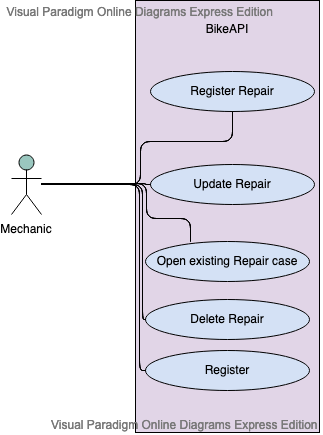
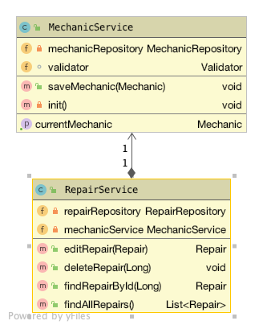

[](http://www.apache.org/licenses/LICENSE-2.0.html)
[](https://heroku.com/deploy)

[](https://bikeapi.herokuapp.com/swagger-ui.html)

# BikeAPI

This Project is Part of the Internet Technologies module in the 5th Semestre of the Business Information Technologies Bachelor at FHNW.

#### Contents:
  - [Analysis](#analysis)
  - [Scenario](#scenario)
  - [Use Case](#use-case)
- [Design](#design)
  - [Endpoint Prototype](#endpoint-prototype)
  - [Data Access / Persistence Layer](#data-access--persistence-layer)
  - [Business Layer](#business-layer)
  - [Service Layer / API](#service-layer--api)
- [Deployment](#deployment)

## Analysis

### Scenario

We develop a very basic API based on a simple Business Scenario. My Scenario is an application, that is situated in my daily business. I own a bike shop and where we also repair bikes. We are four people doing repairs, the system is currently paper based. This is especially a pain when we have to look up a past repair, which would mean we have to dive into the barely structured paper archive. 
The API is deployed in the scenario, where mechanics are enter the repair into the system, assign it a unique number which is on the paper, and free-text the labour executed. For simplicity we don't create bikes as an object themselves, only mechanics and repairs where the bike is mentioned as string.

Important: No Repairnumber can be created twice, if so requested we have to point out previously done work.

It includes CRUD:

Create: Create a new repair Read: Get a repair based on the ID Update: Change the labour free-text Delete: Delete a repair (this will probably happen when a customer rejects a quotation, we only want repairs executed in our database.)


### Use Case

- UC-1 [Register Repair]: A Mechanic enters a Repair into the system by entering information from the physical sheet. Info needed are the repairNumber (Unique identifier), bikeBrand, bikeColor, mechanicName, workPerformed, customerName and Date in DDMMYY.
- UC-2 [Edit a repair]: Mechanics can create, update and delete repair cases.
- UC-3 [Open existing repair case]: Mechanics can search and open existing repair cases. The search can be conducted via the repairNumber or a list of repairs is provided when searching with the customerName.
- UC-4 [Delete a repair]: Mechanics can delete repair cases, this will happen when a customer rejects a quotation.
- UC-5 [Register in System]: Mechanics can register to get an account (profile) to access the system. For simplicity reasons this registration is omitted in this mini-project and simulated in the class MechanicService

## Design

### Endpoint Prototype
**Path**: [`/api/CustomerEndpoint`](/api/CustomerEndpoint) 

**Method:** `POST`

**Sample Request**  • *Header:* `Content-Type: application/json` • *Body:*

```JSON
{
  "bikeBrand": "string",
  "bikeColor": "string",
  "customerName": "string",
  "customerNameName": "string",
  "date": "string",
  "id": 0,
  "mechanic": {
    "email": "string",
    "id": 0,
    "name": "string",
    "password": "string",
    "remember": "string",
    "repairs": [
      null
    ]
  },
  "workPerformed": "string"
}
```

• *Optional:* `...`
  
**Success Response**  • *Code:* `200 OK` • *Sample Body:*

```JSON
{
  "bikeBrand": "string",
  "bikeColor": "string",
  "customerName": "string",
  "customerNameName": "string",
  "date": "string",
  "id": 0,
  "mechanic": {
    "email": "string",
    "id": 0,
    "name": "string",
    "password": "string",
    "remember": "string",
    "repairs": [
      null
    ]
  },
  "workPerformed": "string"
}
```

**Error Response** • *Code:* `404 NOT FOUND`

### Data Access / Persistence Layer

The `rocks.process.acrm.data.domain` package contains the following domain objects / entities - getters and setters not shown:


### Business Layer

The `rocks.process.acrm.business.service` package contains classes of the following business services:




### Service Layer / API

On the service layer, the API for customer management has been realised using the REST style. The functionality is:

GET /api/repair getRepairs
-> Get all Repairs registered

POST /api repair postRepair
-> Post a new repair

GET /api/repair/{repairId} getRepair
-> get a specific repair by ID

PUT /api/repair/{repairId} putRepair
-> Change an existing repair

DELETE /api/repair/{repairId} deleteRepair
-> Delete a repair

Further can be seen using the Swagger-UI.

## Deployment

The app is deployed with Heroku, the functionality can be looked at and tried out utilizing the SwaggerUI :

https://bikeapi.herokuapp.com/swagger-ui.html
