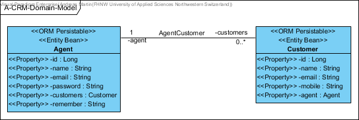

[](http://www.apache.org/licenses/LICENSE-2.0.html)
[](https://heroku.com/deploy)


#BikeAPI

This Project is Part of the Internet Technologies module in the 5th Semestre of the Business Information Technologies Bachelor at FHNW.

#### Contents:
- [Analysis](#analysis)
  - [Scenario](#scenario)
  - [Use Case](#use-case)
- [Design](#design)
  - [Endpoint Prototype](#endpoint-prototype)
  - [Data Access / Persistence Layer](#data-access--persistence-layer)
  - [Business Layer](#business-layer)
  - [Service Layer / API](#service-layer--api)
- [Deployment](#deployment)

## Analysis

### Scenario

We develop a very basic API based on a simple Business Scenario. My Scenario is an application, that is situated in my daily business. I own a bike shop and where we also repair bikes. We are four people doing repairs, the system is currently paper based. This is especially a pain when we have to look up a past repair, which would mean we have to dive into the barely structured paper archive. 
The API is deployed in the scenario, where mechanics are enter the repair into the system, assign it a unique number which is on the paper, and free-text the labour executed. For simplicity we don't create bikes as an object themselves, only mechanics and repairs where the bike is mentioned as string.

Important: No Repairnumber can be created twice, if so requested we have to point out previously done work.

It includes CRUD:

Create: Create a new repair Read: Get a repair based on the ID Update: Change the labour free-text Delete: Delete a repair (this will probably happen when a customer rejects a quotation, we only want repairs executed in our database.)


### Use Case

- UC-1 [Login on A-CRM]: Agents can log-in by entering an email address and password. As an extension, new agents my register first.
- UC-2 [Register on A-CRM]: Agents can register to get an account (profile) to access the A-CRM system.
- UC-3 [Edit a customer]: Agents can create, update and delete customers.
- UC-4 [Show a customer list]: Agents can get an overview over their customers based on a customer list. As an extension they can create, update and delete customers (UC-3).

## Design

### Endpoint Prototype
**Path**: [`/api/customer`](/api/customer) 

**Method:** `POST`

**Sample Request**  • *Header:* `Content-Type: application/json` • *Body:*

```JSON
{
  "agent": {
    "customers": [
      null
    ],
    "email": "string",
    "id": 0,
    "name": "string",
    "password": "string",
    "remember": "string"
  },
  "email": "string",
  "id": 0,
  "mobile": "string",
  "name": "string"
}
```

• *Optional:* `...`
  
**Success Response**  • *Code:* `200 OK` • *Sample Body:*

```JSON
{
  "agent": {
    "customers": [
      null
    ],
    "email": "string",
    "id": 0,
    "name": "string",
    "password": "string",
    "remember": "string"
  },
  "email": "string",
  "id": 0,
  "mobile": "string",
  "name": "string"
}
```

**Error Response** • *Code:* `404 NOT FOUND`

### Data Access / Persistence Layer

The `rocks.process.acrm.data.domain` package contains the following domain objects / entities including getters and setters:



This would be the ERD representation of the domain model:


### Business Layer

The `rocks.process.acrm.business.service` package contains classes of the following business services:


### Service Layer / API

On the service layer, the API for customer management has been realised using the REST style as depicted in the following:


Further can be seen using the Swagger-UI.

## Deployment

This spring boot application can be deployed to Heroku by adding the following `Procfile` to the project root:
```console
web: java -Dserver.port=$PORT $JAVA_OPTS -jar /target/*.jar
```

Finally the Swagger-UI can be access using the Heroku app specific address such as: `https://***.herokuapp.com/swagger-ui.html`
